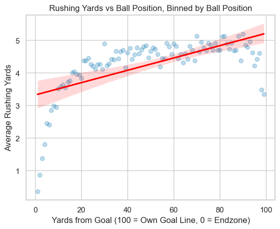
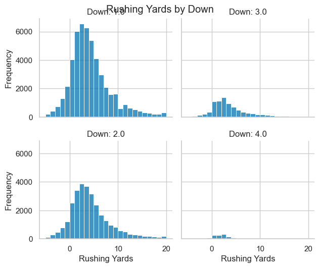
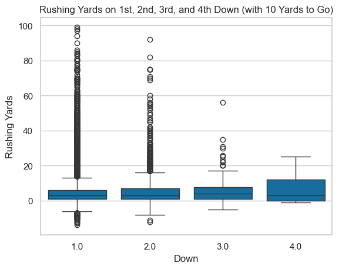
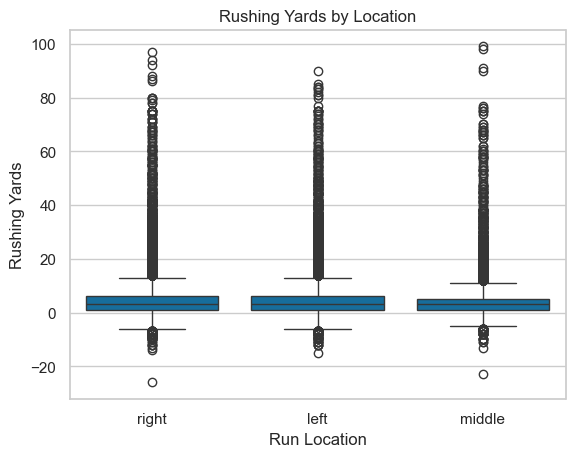
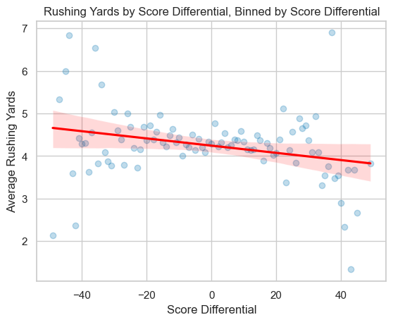

# NFL-Rushing-Analysis-Project

## Project Overview
In this project, I analyzed NFL rushing data from 2016-2022 using Python. The key libraries I used were seaborn, statsmodels, and matplotlib. I used OLS regression to see what factors affected rushing yards. RYOE evaluates rusher efficiency by isolating a player's performance against situational factors like down, distance, run location, and field position.

## Dataset
The dataset used for this analysis was retrieved using Python's nfl_data_py library.

## Key Findings
Field position ('yardline_100') is a key predictor of rushing output. Average rushing yards decay significantly as defensive depth compresses and boundary constraints limit play distance.

## Top RYOE Single Season Performances

| Season | Rusher | Rushes ($n$) | Total RYOE | RYOE / Carry | YPC |
| :---: | :--- | :---: | :---: | :---: | :---: |
| **2021** | **J. Taylor** | 332 | **+471.37** | +1.42 | 5.45 |
| **2020** | **D. Henry** | 395 | **+346.03** | +0.88 | 5.23 |
| **2019** | **L. Jackson** | 126 | **+328.58** | +2.61 | 6.88 |
| **2019** | **D. Henry** | 386 | **+311.73** | +0.81 | 5.15 |
| **2020** | **A. Jones** | 221 | **+301.83** | +1.37 | 5.57 |

<br>

<p align="center">
  
  <br>
  <i>Figure 1: Average Rushing Yards by Ball Position showing boundary constraints near the endzone.</i>
</p>

## Feature Analysis
This exploratory analysis evaluates key factors influencing expected rushing yards prior to the model being fitted.

<table>
  <tr>
    <td width="50%">
      
      <p align="center"><b>Distribution by Down</b></p>
    </td>
    <td width="50%">
      
      <p align="center"><b>Downs with 10 Yards to Go</b></p>
    </td>
  </tr>
  <tr>
    <td width="50%">
      
      <p align="center"><b>Run Location Breakdown</b></p>
    </td>
    <td width="50%">
      
      <p align="center"><b>Score Differential Impact</b></p>
    </td>
  </tr>
</table>


<br>

## OLS Regression Specification
The model predicts expected rushing yards based on `down`, `ydstogo`, interaction terms, `yardline_100`, `run_location`, and `score_differential`.

```text
Dep. Variable: rushing_yards | R-squared: 0.016 | Observations: 91,430
==============================================================================
Variable                  Coef.    Std. Err.       t        P>|t|
------------------------------------------------------------------------------
Intercept                1.6083      0.136      11.846      0.000
down[T.2.0]              1.6149      0.153      10.574      0.000
down[T.3.0]              1.2840      0.161       7.985      0.000
run_location[T.middle]  -0.5638      0.053     -10.725      0.000
ydstogo                  0.2023      0.014      14.433      0.000
yardline_100             0.0186      0.001      21.248      0.000
score_differential      -0.0040      0.002      -2.019      0.044
==============================================================================

